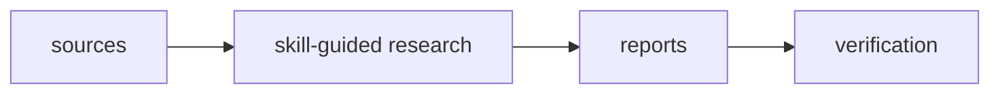

# HLD - 研究型测试仓库

## 架构

研究任务由 task package 指定技能、输入来源和交付路径。agent 读取 `sources/` 下的事实材料，输出到 `reports/`。

```mermaid
flowchart LR
    A["sources"] --> B["skill-guided research"]
    B --> C["reports"]
    C --> D["verification"]
```

## 边界

- 不要求联网。
- 不允许编造外部事实。
- 不修改 task package。

